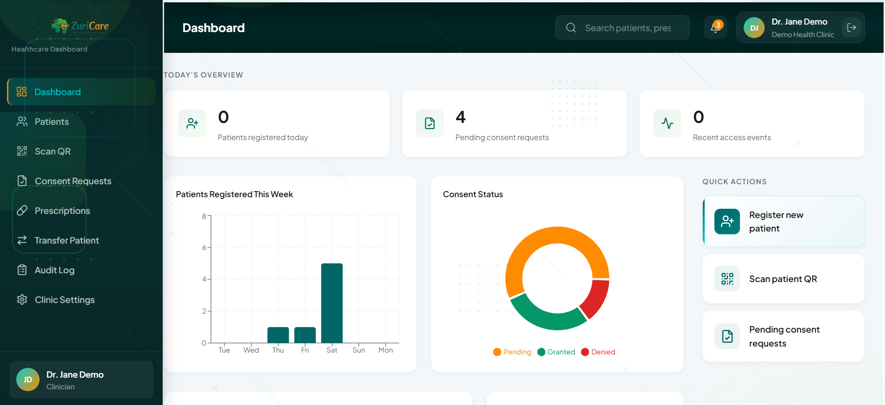
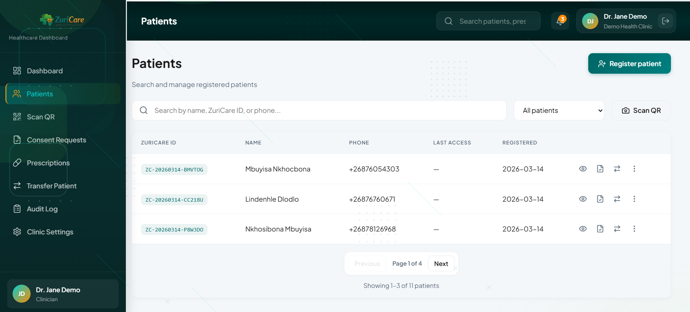
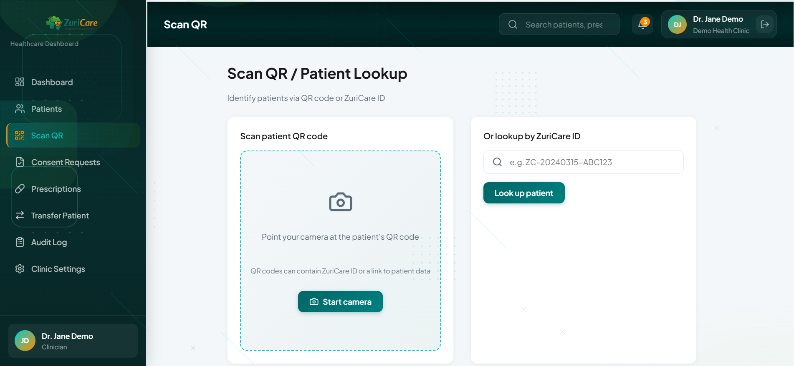
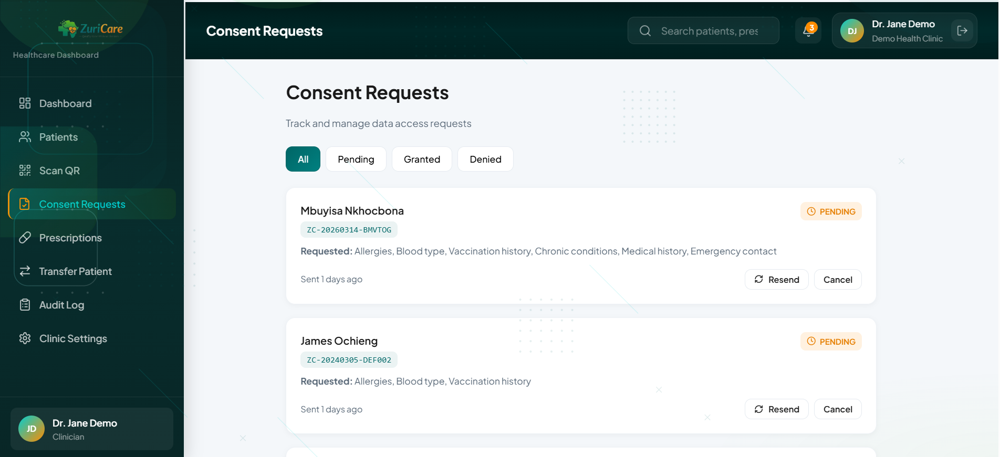
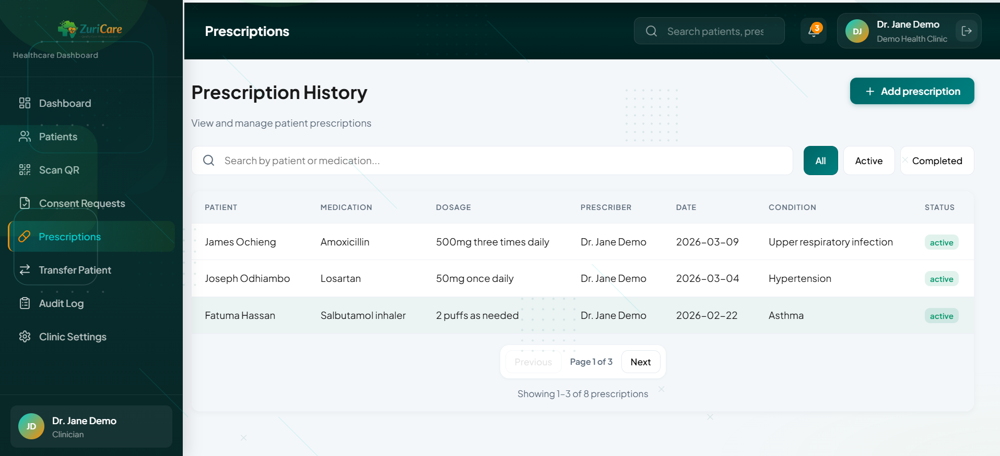
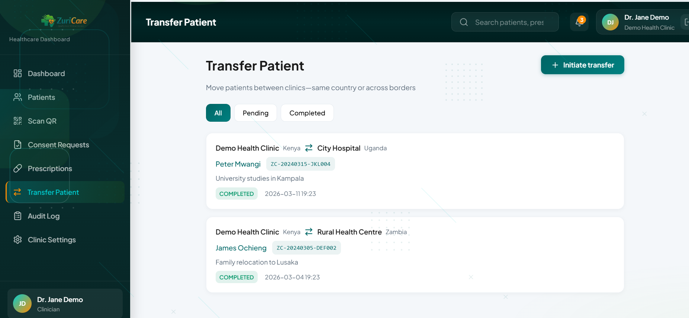
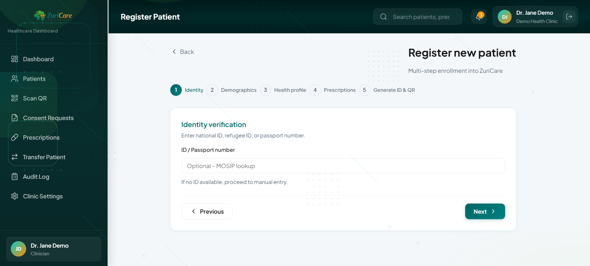
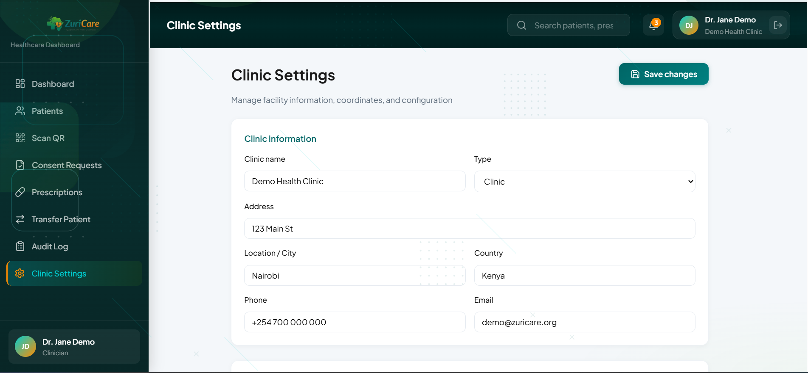

# ZuriCare

**Digital health identity for mobile populations across Africa**

ZuriCare is a healthcare worker dashboard that enables clinics to manage patient records, consent, medical summaries, and transfers—designed for mobile populations, refugees, and communities with limited connectivity.


---

## Features

- **Dashboard** — Overview of patients registered today, pending consent requests, and recent access events with charts
- **Patient Management** — Register and manage patient records
- **QR Code Scanning** — Quick patient lookup via QR code
- **Consent Management** — Handle consent requests for medical record access
- **Request Access** — Request and grant access to patient records
- **Medical Summary** — View and export patient health cards (PDF/image)
- **Prescriptions** — Manage patient prescriptions
- **Audit Log** — Track all access and changes for compliance
- **Patient Transfer** — Transfer patient records between clinics
- **Clinic Settings** — Configure clinic details, coordinates, and staff invites

---

## Screenshots

| Dashboard | Patients | Scan QR |
|:---:|:---:|:---:|
|  |  |  |

| Consent Requests | Prescriptions | Transfer Patient |
|:---:|:---:|:---:|
|  |  |  |

| Register Patient | Clinic Settings |
|:---:|:---:|
|  |  |

---

## Tech Stack

| Layer | Technologies |
|-------|--------------|
| **Frontend** | React 19, TypeScript, Vite, Tailwind CSS, React Router, Recharts, Lucide React |
| **Backend** | Node.js, Express |
| **Database** | MySQL / MariaDB |
| **Auth** | Session-based with bcrypt |

---

## Prerequisites

- **Node.js** 18+ 
- **MySQL** or **MariaDB**
- **npm** or **yarn**

---

## Getting Started

### 1. Clone the repository

```bash
git clone https://github.com/YOUR_USERNAME/zuri.git
cd zuri
```

### 2. Install dependencies

```bash
npm install
```

### 3. Set up the database

Create a MySQL database and run the schema:

```bash
mysql -u root -p -e "CREATE DATABASE zuricare;"
mysql -u root -p zuricare < zuricare_schema.sql
```

Apply migrations (if any):

```bash
npm run db:update
```

(Optional) Seed test data:

```bash
npm run db:test-data
```

### 4. Configure environment variables

Copy the example env file and fill in your values:

```bash
cp .env.example .env
```

Edit `.env` with your settings:

```env
# Database (MariaDB/MySQL)
DB_HOST=localhost
DB_PORT=3306
DB_USER=root
DB_PASSWORD=your_password
DB_NAME=zuricare

# API server
PORT=3001

# App URL (for invite links in emails)
APP_URL=http://localhost:5173

# SMTP (optional - for sending invite emails)
# SMTP_HOST=smtp.gmail.com
# SMTP_PORT=587
# SMTP_USER=your-email@gmail.com
# SMTP_PASS=your-app-password
```

### 5. Run the application

**Option A — Run frontend and backend together (recommended):**

```bash
npm run dev:all
```

**Option B — Run separately:**

```bash
# Terminal 1: API server
npm run server

# Terminal 2: Frontend
npm run dev
```

- **Frontend:** http://localhost:5173  
- **API:** http://localhost:3001  

---

## Available Scripts

| Command | Description |
|---------|-------------|
| `npm run dev` | Start Vite dev server (frontend only) |
| `npm run server` | Start Express API server |
| `npm run dev:all` | Start both frontend and backend concurrently |
| `npm run build` | Build for production |
| `npm run preview` | Preview production build |
| `npm run db:update` | Run database migrations |
| `npm run db:test-data` | Seed test data |
| `npm run lint` | Run ESLint |

---

## Project Structure

```
zuri/
├── src/                    # Frontend (React + TypeScript)
│   ├── api/               # API client
│   ├── components/        # Reusable components
│   ├── contexts/          # React contexts (e.g. AuthContext)
│   ├── pages/             # Page components
│   └── main.tsx
├── server/                 # Backend (Express)
│   ├── routes/            # API routes
│   ├── migrations/        # SQL migrations
│   └── index.js
├── public/
├── zuricare_schema.sql     # Database schema
├── .env.example            # Environment template
└── package.json
```

---

## API Endpoints

| Path | Description |
|------|-------------|
| `/api/auth/*` | Login, logout, staff invites |
| `/api/patients` | Patient CRUD |
| `/api/consent` | Consent requests |
| `/api/medical-summary` | Medical summaries |
| `/api/prescriptions` | Prescriptions |
| `/api/audit` | Audit log |
| `/api/dashboard` | Dashboard stats and charts |
| `/api/transfers` | Patient transfers |
| `/api/clinic` | Clinic settings |

---

## License

This project is private. All rights reserved.

---

## Contributing

1. Fork the repository  
2. Create a feature branch (`git checkout -b feature/amazing-feature`)  
3. Commit your changes (`git commit -m 'Add amazing feature'`)  
4. Push to the branch (`git push origin feature/amazing-feature`)  
5. Open a Pull Request  

---

Built for healthcare workers serving mobile populations across Africa.
